# bandnamegenerator

bandnamegenerator is an interactive band name generation website created to help spread more diverse and unique band names out into the world. The goal of the website is to assist in coming up with new and fresh band names and the main target demograpic would be aspiring founders of new music bands. bandnamegenerator will be a great tool to use while brainstorming band names for beginners but it could be just as useful to experienced bands looking to rebrand themselves.

Visit the site here: https://ignurof.github.io/bandnamegenerator

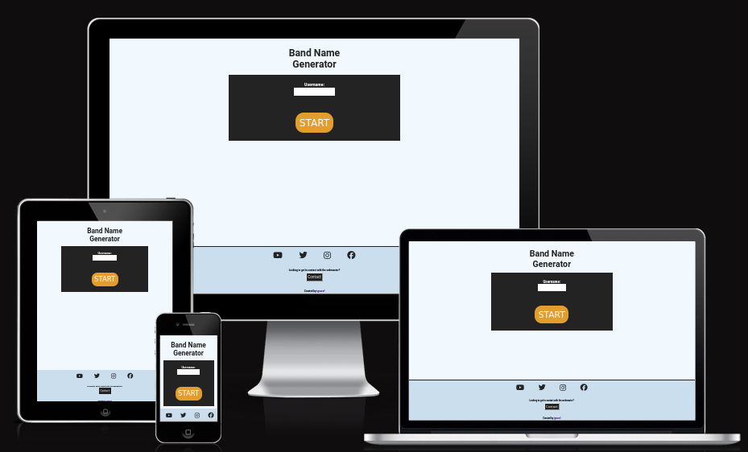

# Table of Contents

- [**Features**](#features)
    + [Existing Features](#existing-features)
    + [Features Left to Implement](#features-left-to-implement)
- [**User Experience**](#user-experience)
    + [Wireframes](#wireframes)
    + [Interaction Experience](#interaction-experience)
- [**Testing**](#testing)
    + [Manual Testing](#manual-testing)
    + [Validator Testing](#validator-testing)
    + [Unfixed Bugs](#unfixed-bugs)
- [**Deployment**](#deployment)
- [**Credits**](#credits)

## Features 

The main feature of the website that will really make it stand out in my opinion would be that everything will be handled on one page, as if it were an app.
With the help of JavaScript's DOM Manipulation the website can be built in such a way that the page content will be switched out dynamically and with a smooth transition to ease between two different page's content.
Nice and snappy animated transitions with the help of CSS to really make the website pop and give the user some nice interaction feedback experience.

### Existing Features

Mobile Home view
The landingpage of the website and also the start of the app.

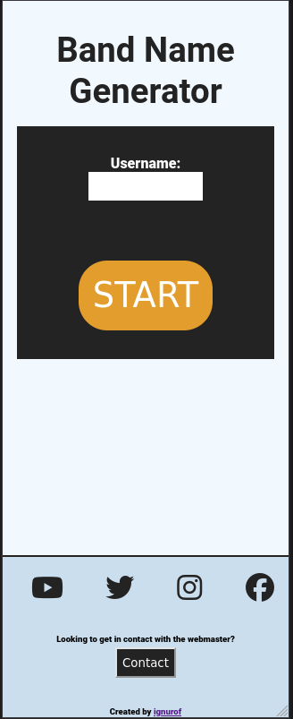  

Mobile Home error view
Input validation handles username input to avoid a bad username.
Realtime error processing of username input.

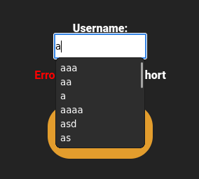  

Mobile Generator view
Fun little app with values to pick from to generate a new band name.

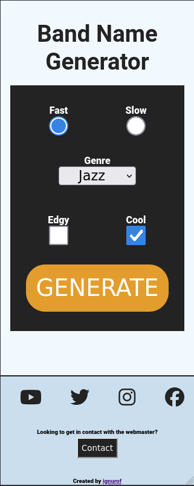  

Mobile Result view
Displays the results from the app band name generation and lets the user regenerate from the same values or try again from the start.

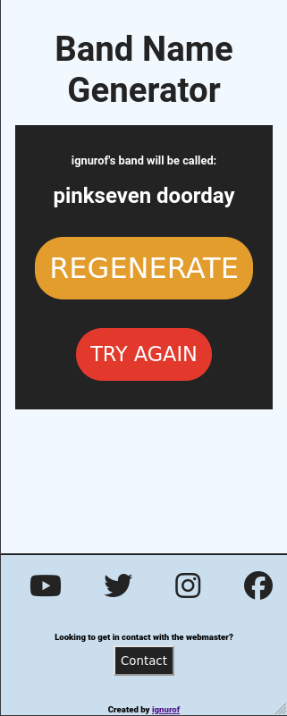  

Mobile Contact view
The place to contact the webmaster.

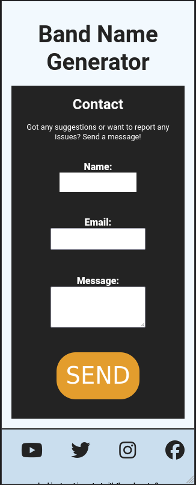  

Mobile Contact error view
Input validation handles input to avoid a bad contact details.
Realtime error processing of contact input.

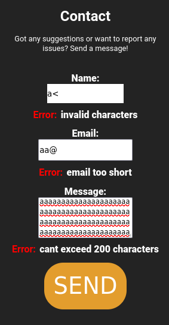  

Mobile Thanks view
Sending the contact form currently does not send anything, any only redirects to this page.

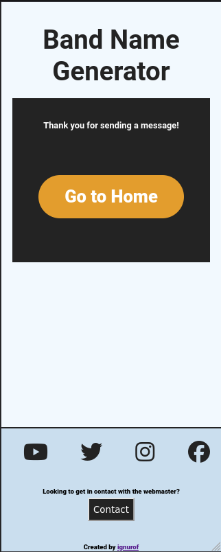  

Mobile 404 view
If there is ever an error the user will be redirected here.

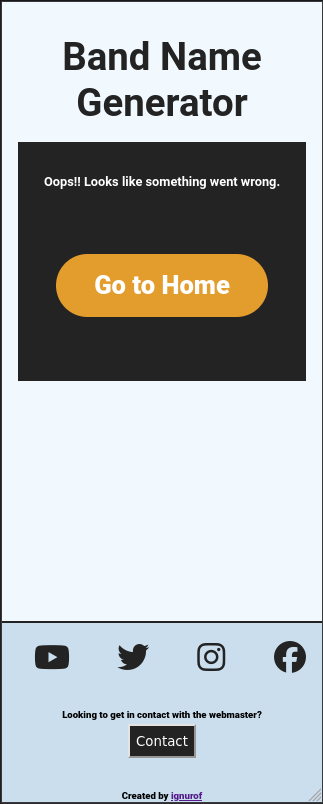  

Laptop Home view

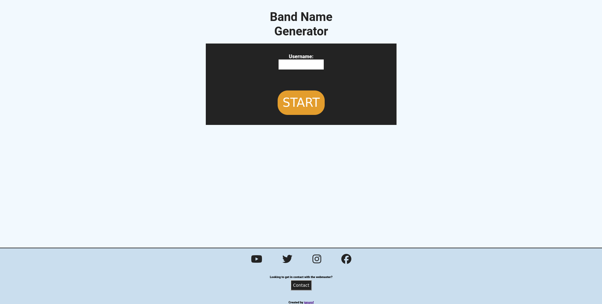  

Laptop Home error view

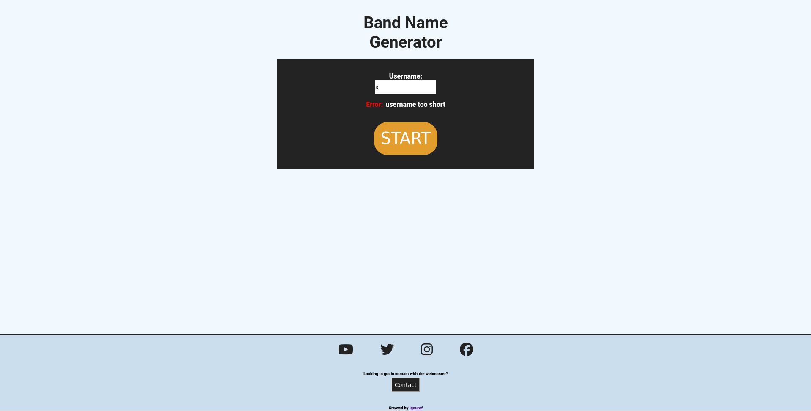  

Laptop Generator view

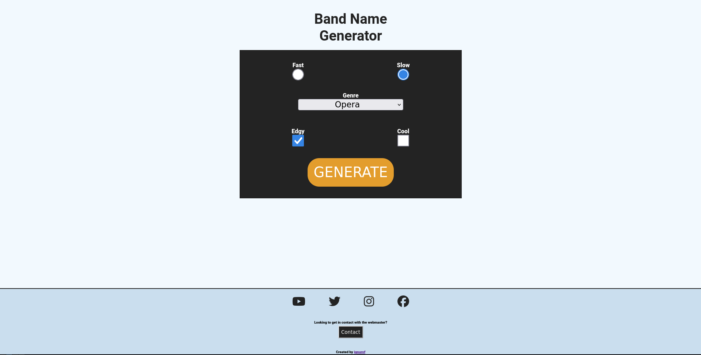  

Laptop Result view

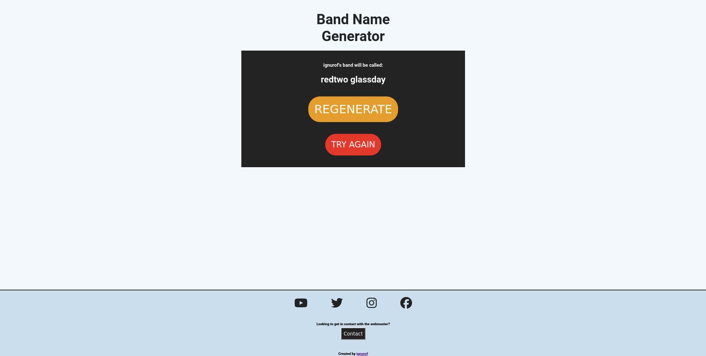  

Laptop Contact view

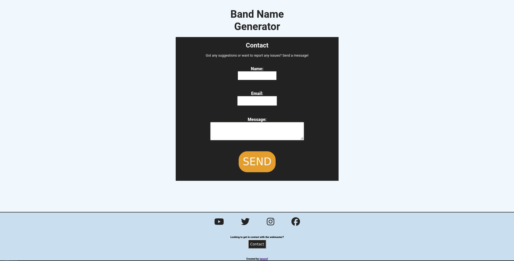  

Laptop Contact error view

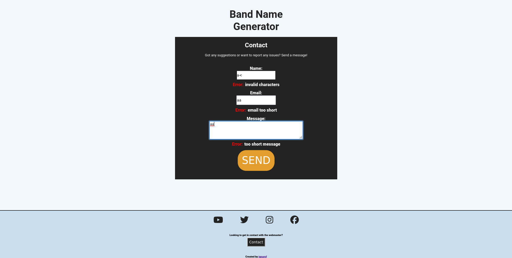  

Laptop Thanks view

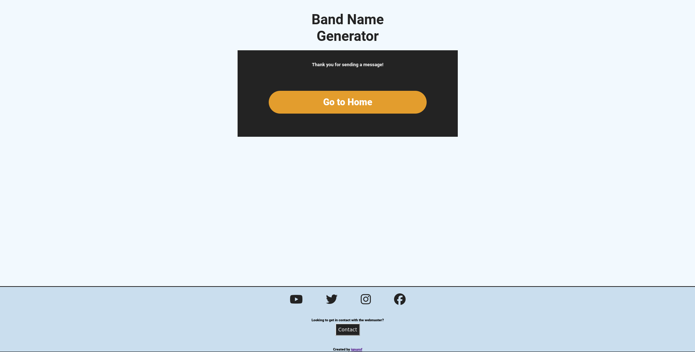  

Laptop 404 view

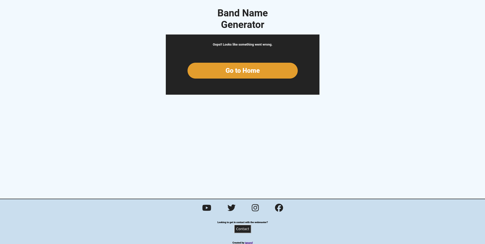  

### Features Left to Implement

- Animated page view transitions
- Interaction feedback on buttons
- Interaction feedback on inputs

## User Experience

My main thought process going into this project and this app website idea was that the user experience should be as smooth and logical as possible so users of any skillset and capacity can utilize the website's features and have a good time while visiting.
I want the experience to invoke positivity and happiness with the user as they are interacting with the site and the intention is to eventually funnel the users from this generator app to all the other generator app websites that I want to create in the future.

### Wireframes

Mobile Home view

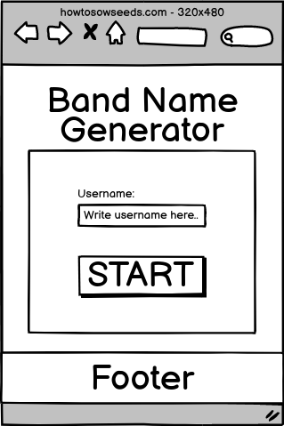

Mobile Generator view

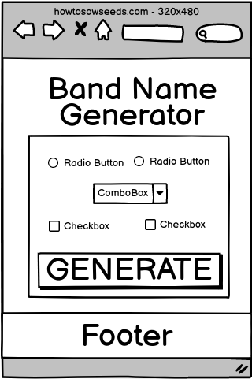

Mobile Result view

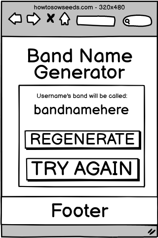

Mobile Contact view

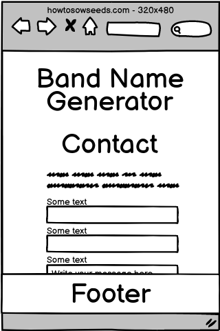

Laptop Home view

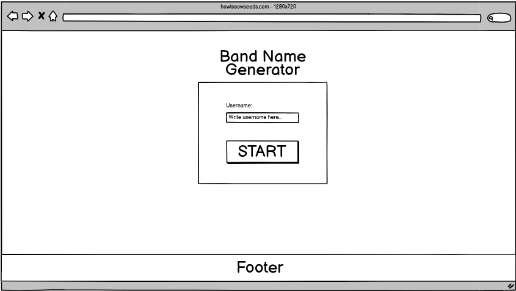

Laptop Generator view

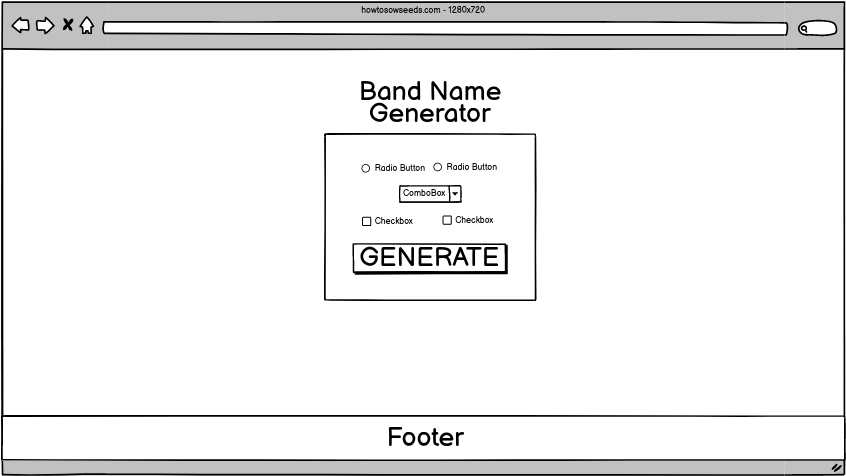

Laptop Result view

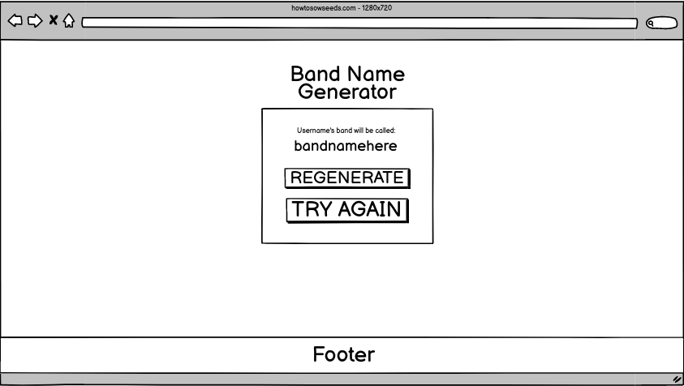

Laptop Contact view

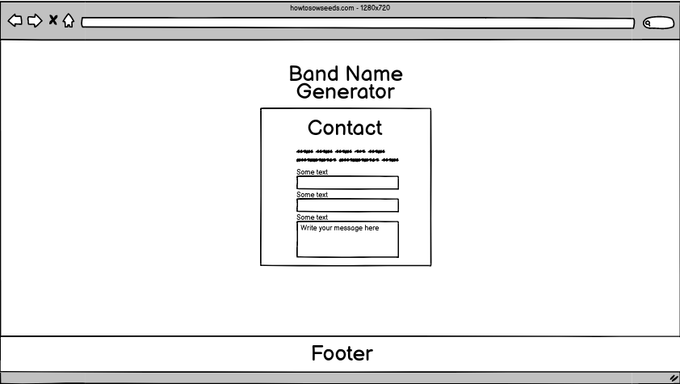

### Interaction Experience

I wanted to improve the interaction experience in this project by including things such as animated transitions between page views and powerful feedback when the user interacts with the various input buttons and fields available on the site.
Due to my own time constraints I could not get the right amount of interaction in place for me to consider this site to have a good quality interaction experience so that will have to be revisited at a later date so that it can be improved upon.

The main interaction experience the user will find on this website will be the dynamic switching between page views while staying on the same technical webpage, just like a mobile app would look and feel.
There is also the interactions the user takes to go through the process from start to finish of generating a band name with the help of the website.
A great deal of effort went into making sure input error messages give the user good feedback to whats happening, with realtime processing of user input to accurately display what their input fields are missing.

## Testing 

During the whole development process I have actively tested and previewed the website using Firefox on my laptop and sometimes switching over to an Android phone to check it out on Chrome. I would plan a feature, expect how it should work, implement it and then manually test the feature by going through the motions like a regular user of the website would to see if it would produce the correct results. If the result was not correct, or just something looked off in general like with the styling for example, then I would just iterate on that specific feature or issue until it worked and/or looked correctly before moving on.
You can see some semblance of how my testing process has gone on by looking at the merge request history for the prod branch when I was testing some things on a phone.
This whole process have definitely taught me that testing on different devices and browsers is extremely important!
Just because our browser devtools are showing us it looks responsive and correct, it might infact not be so on the actual devices!

### Manual Testing

My process for manually testing the website is very rudimentary and straightforward.
First I always personally test new implementations using the DevTools after each development step.
When I consider a feature complete or a set of features that go together complete, then I move onto the real manual testing.
I put myself in the shows of a random user just stumbling upon the website for the first time for each feature I want to test.
The process looks something like this:

- Go to the page/section that contains the feature I want to test.
- Click, write, resize and other interactions that the user might do.
- Note any eventual errors, logical or styling issues down in a notepad.
- Step through the code from top to bottom to work through the issue.
- Test the changes and confirm the issue is fixed before pushing changes.

### Validator Testing 

HTML was tested through the w3.org validator found here: https://validator.w3.org

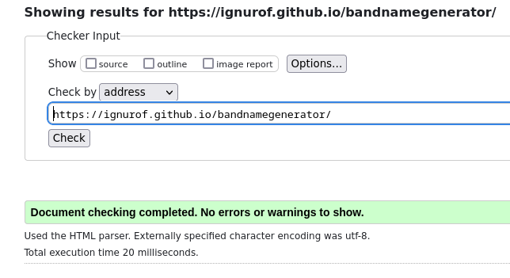

CSS was tested through the jigsaw.w3.org css specific validator found here: https://jigsaw.w3.org/css-validator/

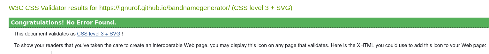

JS was tested using JSHint found at https://jshint.com/

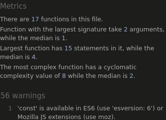

### Unfixed Bugs

None

## Deployment

GitHub pages were used to deploy this website and this step by step guide will tell you how to deploy it yourself after you have cloned the repository.

- Click the "Settings" tab. 
- Go to "Pages" under the "Code and Automation" section. 
- Make sure Source is set to "Deploy from a branch".
- Under the "Branch" heading, click the dropdown and select "prod".
- If you don't have the "prod" branch, you can select "main" or "master" instead.
- Click "Save" and the site will be deployed to GitHub Pages.
- Now you can visit the site located at: https://your-username-here.github.io/repository-name-here

## Credits 

- The readme is from the template made by Code Institute (https://github.com/Code-Institute-Solutions/readme-template)
- The greatest documentation Mozilla Developer Docs: https://developer.mozilla.org/en-US/
- Invaluable syntax helper w3schools: https://www.w3schools.com/
- Amazing regular expression resource: https://regexr.com/
- Cool resource about inputs: https://benhoyt.com/writings/dont-sanitize-do-escape/

### Content 

- Repo Banner image with the help of: https://ui.dev/amiresponsive
- Wireframes created with Balsamiq Cloud: https://balsamiq.cloud
- Fonts (Roboto) by: https://fonts.google.com/

### Media

- Social media icons are from FontAwesome: https://fontawesome.com/
- Favicon: https://favicon.io/emoji-favicons/studio-microphone

###### Created and Maintained by (https://github.com/ignurof)
